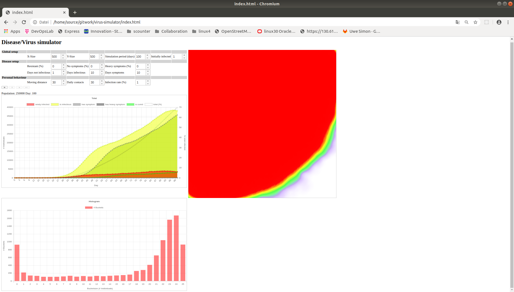

# virus-simulator
A simple simulator for the transmission of human diseases and viruses.

**Caution: This is a simulation only based on a simple model. It's not virological/medical proofed**

The simulation uses a chess board like setup. In each cell is an individual. It can move by random in a defined area and if infected can infect other individuals. Some infected individuals will show heavy symptoms.

Some assumptions:

- individuals which show symptoms behave rational and will not infect other individuals
- The durations of the infections are average durations and are the same for all individuals.



## start
Copy this repository into a local directory

In your browser - recent version of Chrome and Firefox should work fine - open file 
```
    index.html
```
## Simulations

There are several possibilities to configure the simulator

### Global setup

Configure the number of people on a chessboard like setup, the simulation period and the initial number of infected individuals. The individuals will be located randomized on the board.

| Field  | Description |
| ------ | ----------- |
| X-Size | The width of the area |
| Y-Size | The heigh of the area |
| Simulation period (days)| The duration of the simulation in days |
| Initially infected |The number of individuals which are initially | infected

### Disease setup

Configure the behaviour of the disease/virus.

| Field  | Description |
| ------ | ----------- |
| Resistant (%)       | Percentage of individuals which are resistant against the diseae/virus |
| No symptoms (%)     | Percentage of infected individuals which do not show any symptoms, so do not know that they are infected |
| Heavy symptoms (%)  | Percentage of infected indifiduals which will have heayy symptoms |
| Days not infectious | The number of days after the infection until an infected individual can transfer the disease/virus to other individuals |
| Days infectious     | Number of days the infected individuals are infectious |
| Days symptoms       | Number of days the infectedt individuals show symptoms |

### Personal behaviour

Configure the personal behaviour of the individuals

| Field              | Description |
| ------------------ | ----------- |
| Moving distance    | The distance individuals move to left/right up/down |
| Daily contacts     | The number of daly contacts |
| Infection rate (%) | The percentage of individuals infected by a contact to another infected individual. |
```